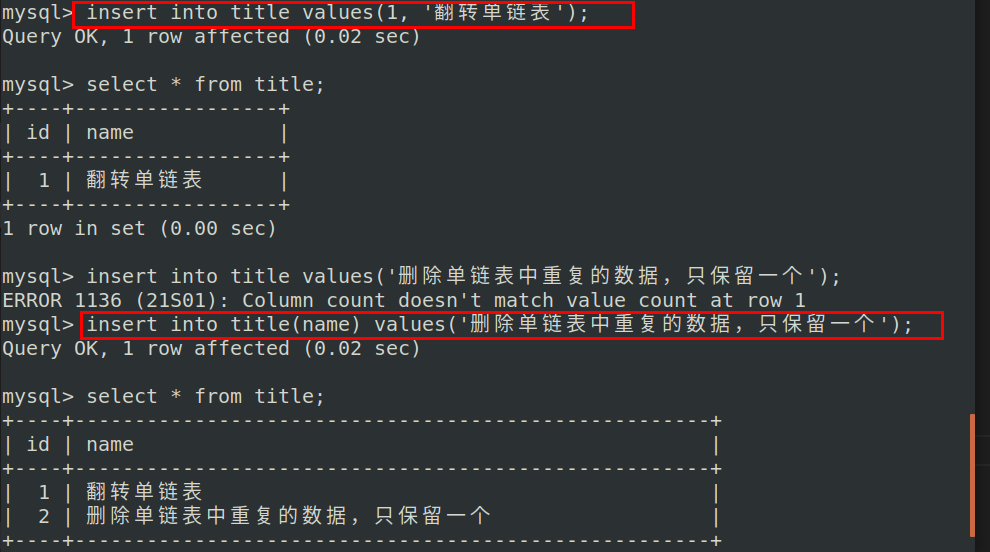

# MySQL命令

```shell
#开启
service mysql start

#关闭
service mysql stop

#重启
service mysql restart
```

```shell
#登录进入
mysql -u root -p 
```

```mysql
#显示数据库
show databases; # 注意分号

#创建数据库
create database serverdb;

#删除数据库
drop database 数据库名;

#使用数据库
use serverdb;

#创建表
CREATE TABLE user(
    username char(50) NULL,
    passwd char(50) NULL
)ENGINE=InnoDB;

#添加数据
INSERT INTO user(username, passwd) VALUES('name', 'passwd');

#显示表
show tables;

#显示数据表结构
describe 数据表名;
```

向表中添加数据



